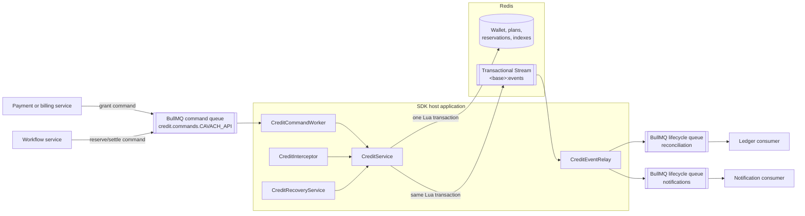
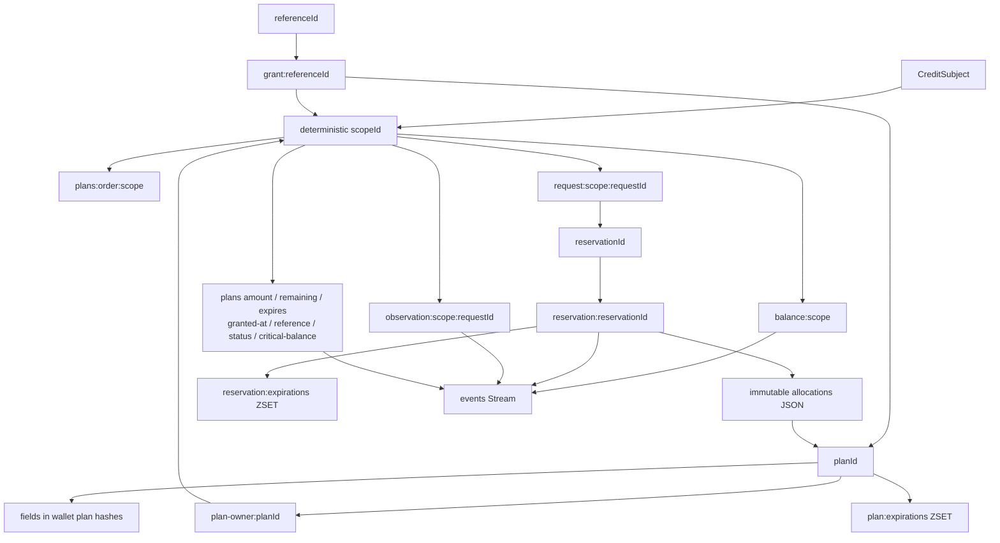
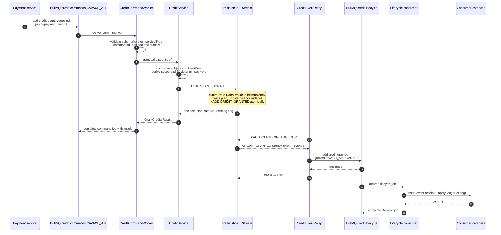
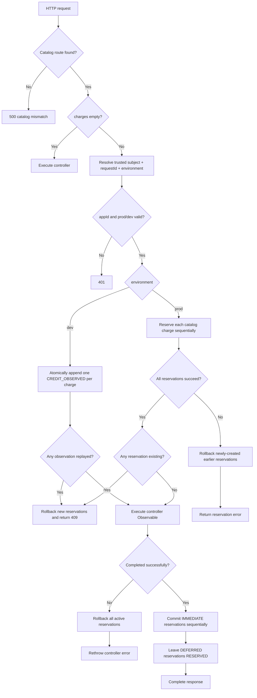
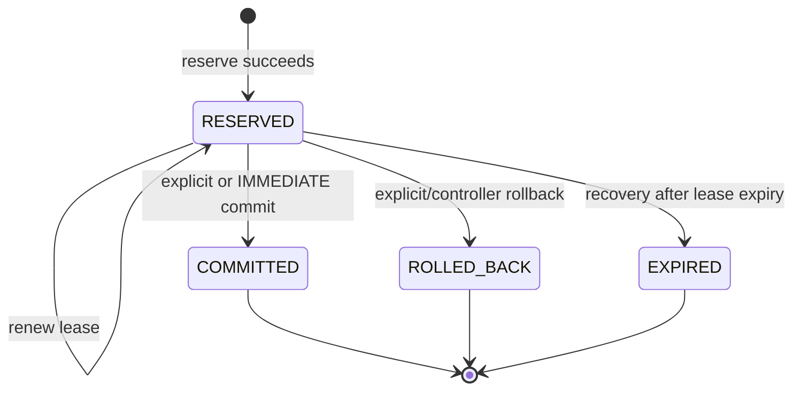

# Credit middleware technical architecture

This document describes the logical architecture and internal execution paths
of `@hypersign-protocol/credit-middleware` version 5.0.0. It follows commands,
HTTP reservations, Redis state, outbox events, BullMQ jobs, settlement, and
recovery down to their key relationships and atomicity boundaries.

The examples use the bundled catalog `CAVACH_API@3.21.1` and default queue names.

## Contents

- [System boundaries](#system-boundaries)
- [Channels and ownership](#channels-and-ownership)
- [Logical component architecture](#logical-component-architecture)
- [Deterministic state graph](#deterministic-state-graph)
- [End-to-end grant command](#end-to-end-grant-command)
- [Grant transaction algorithm](#grant-transaction-algorithm)
- [Per-request HTTP billing flow](#per-request-http-billing-flow)
- [Reservation algorithm](#reservation-algorithm)
- [Commit, rollback, and recovery](#commit-rollback-and-recovery)
- [Outbox relay algorithm](#outbox-relay-algorithm)
- [Events and their causes](#events-and-their-causes)
- [Commands and their outcomes](#commands-and-their-outcomes)
- [Idempotency model](#idempotency-model)
- [Failure analysis](#failure-analysis)
- [Concurrency and ordering](#concurrency-and-ordering)
- [Operational tracing](#operational-tracing)

## System boundaries

The architecture contains five logical systems:

1. **Trusted command producer** — normally a payment, billing, or workflow
   service. It creates stable command IDs and publishes commands.
2. **SDK host application** — the NestJS API that imports `CreditModule`. It
   runs the command worker, HTTP interceptor, Redis operations, and Stream
   relay.
3. **Redis credit state** — deterministic wallet, plan, reservation, observation,
   idempotency, expiry-index, and Stream keys changed by Lua.
4. **BullMQ transport** — command and lifecycle queues. BullMQ owns its
   physical Redis keys.
5. **Lifecycle consumer** — reconciliation, ledger, notification, or analytics
   service that handles lifecycle jobs idempotently.

The SDK does not expose a Redis Pub/Sub channel. The word “channel” in this
architecture refers to a durable BullMQ queue or to the internal Redis Stream.

## Channels and ownership

| Stage | Logical channel | Default identifier | Who writes | Who receives |
| --- | --- | --- | --- | --- |
| Inbound command | BullMQ queue | `credit.commands.CAVACH_API` | Trusted producer | `CreditCommandWorker` inside SDK hosts |
| Transactional outbox | Redis Stream | `<keyPrefix>:v2:{<redisHashTag>}:events` | Credit Lua scripts | `CreditEventRelay` |
| Outbound lifecycle | BullMQ queue | `credit.lifecycle` | `CreditEventRelay` | External lifecycle workers |
| Command rejection | BullMQ lifecycle queue | configured lifecycle queue(s) | `CreditCommandWorker` directly | External lifecycle workers |

Important delivery behavior:

- API replicas listening to `credit.commands.CAVACH_API` are competing consumers.
  Exactly one available BullMQ worker processes a delivery attempt.
- Lifecycle workers listening to one `credit.lifecycle` queue also compete.
  Create separate lifecycle queue names for consumers that each need a copy.
- The Redis Stream is internal SDK transport. External services should consume
  lifecycle queues rather than reading the Stream directly.
- BullMQ physical keys are created automatically. Producers and consumers set
  queue names and the same optional BullMQ `prefix`; they do not construct
  `bull:*` keys.

## Logical component architecture



`CreditService` does not publish a lifecycle BullMQ job directly. It writes
state and an event to the Redis Stream in one Lua transaction. This separation
prevents a successful balance change from being lost merely because BullMQ is
temporarily unavailable.

`credit.command-rejected` is the exception: the command worker publishes it
directly to lifecycle queues because the rejected command may not have produced
any valid financial state transition to place in the outbox.

## Deterministic state graph

### Key base and scope

All SDK keys begin with:

```text
<base> = <keyPrefix>:v2:{<redisHashTag>}
```

The deterministic wallet scope is:

```text
<scope> = tenant=<presence/value>
          |appType=<presence/value>
          |app=<presence/value>
          |creditType=<presence/value>
```

A missing dimension is `0`; a present dimension is
`1:<encodeURIComponent(trimmedValue)>`.

Example:

```text
tenant=1:tenant_1|appType=1:CAVACH_API|app=1:app%3A123|creditType=1:API_CREDIT
```

### Key relationship diagram



### Keys used by a grant

For one `grant()` call, TypeScript derives these 14 keys and passes them to one
Lua invocation:

| Lua key | Pattern | Role |
| --- | --- | --- |
| `KEYS[1]` | `<base>:balance:<scope>` | Cached wallet balance |
| `KEYS[2]` | `<base>:plans:order:<scope>` | Active FIFO plan order |
| `KEYS[3]` | `<base>:plans:amount:<scope>` | Immutable original amounts |
| `KEYS[4]` | `<base>:plans:remaining:<scope>` | Available amounts |
| `KEYS[5]` | `<base>:plans:expires:<scope>` | Plan expiry times |
| `KEYS[6]` | `<base>:plans:granted-at:<scope>` | FIFO timestamps |
| `KEYS[7]` | `<base>:plans:reference:<scope>` | Plan-to-payment references |
| `KEYS[8]` | `<base>:plans:status:<scope>` | Plan statuses |
| `KEYS[9]` | `<base>:plans:expiration-member:<scope>` | Plan-to-global-index members |
| `KEYS[10]` | `<base>:plan-owner:<encoded-planId>` | Global plan ownership |
| `KEYS[11]` | `<base>:grant:<encoded-referenceId>` | Global grant idempotency |
| `KEYS[12]` | `<base>:plan:expirations` | Global due-plan sorted set |
| `KEYS[13]` | `<base>:events` | Transactional outbox Stream |
| `KEYS[14]` | `<base>:plans:critical-balance:<scope>` | Immutable plan thresholds |

The common `{redisHashTag}` makes all 14 keys legal in one Redis Cluster Lua
operation.

## End-to-end grant command

### Participants

- Producer queue: `credit.commands.CAVACH_API`
- BullMQ command job name: `credit.grant.requested`
- SDK receiver: `CreditCommandWorker`
- financial operation: `CreditService.grant()`
- Redis program: `GRANT_SCRIPT`
- outbox event: `CREDIT_GRANTED`
- lifecycle BullMQ job name: `credit.granted`
- default lifecycle queue: `credit.lifecycle`

### Sequence



### Command envelope

The producer sends:

```ts
import {
  CreditAppType,
  CreditEventName,
  CreditServiceType,
  CreditType,
} from '@hypersign-protocol/credit-middleware';

await queue.add(
  CreditEventName.GRANT_REQUESTED,
  {
    schemaVersion: 3,
    commandId: payment.eventId,
    serviceType: CreditServiceType.CAVACH_API,
    source: 'payment-service',
    requestedAt: new Date().toISOString(),
    payload: {
      subject: {
        tenantId: 'tenant_1',
        appType: CreditAppType.CAVACH_API,
        appId: 'app:123',
        creditType: CreditType.API_CREDIT,
      },
      planId: payment.planId,
      amount: 100,
      criticalBalance: payment.criticalBalance,
      grantedAt: payment.createdAt.getTime(),
      expiresAt: payment.expiresAt.getTime(),
      referenceId: payment.transactionId,
      reason: 'credit_purchase',
    },
  },
  { jobId: payment.eventId },
);
```

The queue producer and consumer need the same BullMQ connection, queue name,
and optional BullMQ `prefix`. The producer does not need the SDK `keyPrefix` or
`redisHashTag`.

### Which process receives the grant?

Every running SDK host with BullMQ enabled creates a worker on its configured
`commandQueueName`. With the bundled catalog, the default is
`credit.commands.CAVACH_API`.

If three API replicas listen to that queue, they compete. BullMQ selects one
worker for a delivery attempt. A different replica can receive a retry after a
worker failure. The Redis grant algorithm is therefore idempotent and does not
depend on one specific replica.

The independent lifecycle consumer does not receive `credit.grant.requested`.
It later receives `credit.granted` from a lifecycle queue after the Redis
transaction succeeds and the Stream relay publishes the event.

## Grant transaction algorithm

### TypeScript validation

Before Redis executes Lua, `CreditService.grant()`:

1. trims and validates the subject;
2. trims `planId` and `referenceId` and rejects control characters;
3. requires `amount`, `grantedAt`, and `expiresAt` to be positive safe integers,
   and `criticalBalance` to be a non-negative safe integer;
4. rejects `grantedAt` in the future;
5. requires `expiresAt > grantedAt`;
6. derives the deterministic scope, expiry member, and all Redis keys; and
7. supplies the current server time and configured limits to Lua.

The command worker separately requires `subject.appId` and
`subject.creditType`, validates schema version `3`, and requires its
`serviceType` to equal `CAVACH_API`.

### Atomic Lua pseudocode

```text
GRANT(input, now):
  balance = cached balance or 0

  for each active plan in FIFO set:
    if plan.expiresAt <= now:
      subtract unused amount from balance
      remaining = 0
      status = EXPIRED
      remove plan from active and expiry indexes
      append PLAN_EXPIRED to Stream

  persist corrected balance

  if planId already exists in this wallet:
    if amount, expiresAt, grantedAt, referenceId, or criticalBalance differ:
      reject conflicting plan retry
    return existing result without another CREDIT_GRANTED event

  if global plan-owner exists for another scope:
    reject cross-wallet planId reuse

  if referenceId points to another plan or scope:
    reject reference reuse

  if reference idempotency exists but plan state is missing:
    fail as inconsistent Redis state

  if expiresAt <= now:
    reject already-expired new plan

  if active plan count >= maxActivePlans:
    reject capacity breach

  if balance + amount exceeds Number.MAX_SAFE_INTEGER:
    reject overflow

  increment cached balance
  add planId to FIFO ZSET with score grantedAt
  write amount, remaining, expiry, grant time, reference, critical balance,
    and ACTIVE status
  write global plan ownership
  write global grant idempotency record
  add encoded plan member to plan-expiration ZSET
  append CREDIT_GRANTED to Stream

  return new wallet balance, full plan balance, existing=false
```

All mutations and `CREDIT_GRANTED` occur in the same Redis atomic operation.
Other clients see either the state before the grant or the complete new plan;
they cannot observe a balance without its plan metadata or its outbox event.

### Grant outcomes

| Condition | Service behavior | New grant event? |
| --- | --- | --- |
| New valid plan | Returns `existing: false` | Yes, one `CREDIT_GRANTED` |
| Exact retry | Returns `existing: true` | No |
| Same plan, changed semantics | HTTP-style `400 Bad Request` exception | No grant event |
| Reference assigned elsewhere | `400 Bad Request` | No grant event |
| Plan owned by another wallet | `400 Bad Request` | No grant event |
| Plan capacity reached | `503 Service Unavailable` | No grant event |
| Safe-integer overflow | `400 Bad Request` | No grant event |
| New plan already expired | `400 Bad Request` | No grant event |
| Reference exists but plan state is missing | Internal consistency error | No grant event |

Expired old plans discovered at the beginning of an attempted grant can still
produce `PLAN_EXPIRED` events even if the new grant is later rejected. Those
expiry transitions are valid cleanup, not partial application of the new
grant.

## Per-request HTTP billing flow



Each catalog charge gets its own request ID:

```text
<trusted-requestId>:<catalog-charge-id>
```

Its `creditType` comes from the catalog and is applied to the trusted base
subject. This makes charges for different credit types separate wallets and
separate reservations. Environment is not added to wallet scope.

### dev observation algorithm

One observation uses two keys: the scoped observation-idempotency hash and the
transactional event Stream.

```text
OBSERVE(input, now):
  if observation key exists:
    reject if amount, operation, or environment changed
    return original eventId with existing=true

  append CREDIT_OBSERVED with requestedAmount and deductedAmount=0
  retain eventId and immutable semantics for retentionMs
  return eventId with existing=false
```

The script never reads or writes balance, plan, reservation, or expiry-index
keys. Thus a `dev` call works without any granted plan and cannot consume `prod`
credit. The observation remains an audit of attempted usage if the controller
later fails or an early boundary ends the response. A missing or unknown
environment is rejected before either Lua path.

## Reservation algorithm

One reserve operation uses 12 keys: wallet balance, FIFO order, remaining
amounts, expiries, statuses, grant times, plan-expiry members, the new
reservation, request idempotency, reservation-expiry index, plan-expiry index,
and the event Stream.

```text
RESERVE(input, now):
  if request key already exists:
    if amount, settlement mode, operation, or autoRecover differ:
      reject requestId reuse
    return original reservation with existing=true

  expire stale active plans and emit PLAN_EXPIRED for each
  read active plan IDs in grantedAt/planId order

  needed = amount
  allocations = []
  for each eligible plan while needed > 0:
    fail if allocation-count limit would be exceeded
    take = min(plan.available, needed)
    append {planId, take}
    needed -= take

  if needed > 0:
    reject insufficient credit without reservation deductions

  decrement cached wallet balance by total amount
  decrement each selected plan
  remove depleted plans from active and plan-expiry indexes
  store immutable allocations JSON
  store reservation hash with status RESERVED and lease token
  store request-idempotency hash
  if autoRecover: add reservation to lease-expiry ZSET
  append one RESERVED event per allocation

  return reservation and allocation data
```

The allocation calculation and deductions happen within one Lua call. A
failed funding check never leaves a partial reservation. Lazy expiration of
already-expired plans can still be committed because it is independent cleanup.

## Commit, rollback, and recovery

### Reservation state machine



Final states do not transition again. Repeated settlement is safe and reports
that the requested transition was not newly applied.

### Commit

Commit does not deduct credits again. It:

1. requires reservation status `RESERVED`;
2. sets status `COMMITTED`, final time, and reason;
3. removes the reservation from the lease-expiry index;
4. applies `retentionMs` to reservation and request keys; and
5. appends one `COMMITTED` event per immutable plan allocation; and
6. for each allocation whose current plan balance is at or below that plan's
   immutable threshold, appends one `CRITICAL_BALANCE` event.

Commit remains valid after a plan expires because the credit was removed from
availability when the reservation was created.

### Rollback

For every stored allocation, rollback checks the original plan at settlement
time:

```text
if plan expiry is in the future and status is not EXPIRED/REVOKED:
  restore allocation to that plan
  mark it ACTIVE
  reinsert it into FIFO and plan-expiry indexes
  increase wallet balance
  outcome.restoredAmount = allocation.amount
else:
  do not restore reserved credit
  expire any other currently-unused amount in that plan
  remove plan from active and expiry indexes
  outcome.expiredAmount = allocation.amount
```

The script then finalizes the reservation as `ROLLED_BACK`, applies retention,
emits any required `PLAN_EXPIRED` events, and emits one `ROLLED_BACK` event per
allocation.

### Lease recovery

`CreditRecoveryService.runOnce()` reads due reservation IDs from
`<base>:reservation:expirations` in bounded batches. For each reservation, the
recovery Lua script requires:

- status `RESERVED`;
- `autoRecover != false`; and
- stored `expiresAt <= recovery time`.

It then performs the same plan-aware refund algorithm as rollback but finalizes
the reservation as `EXPIRED` with reason `lease_expired`. It emits one
`EXPIRED` event per allocation.

### Plan expiry recovery

The same recovery pass reads due members from `<base>:plan:expirations`. For
each due plan, Lua removes unused availability, updates the cached balance,
marks the plan `EXPIRED`, removes its active/index entries, and appends
`PLAN_EXPIRED`.

Plan expiry is also performed lazily by grant, reserve, and refund operations.
The first atomic operation to apply the state change wins; later attempts see
the final status and do not apply it again.

## Outbox relay algorithm

The relay uses a dedicated blocking Redis connection. Its default consumer
group is `credit-bull-relay:CAVACH_API`; each process creates a unique consumer name
`<pid>-<UUID>`.

```text
ON STARTUP:
  create Stream consumer group at ID 0 with MKSTREAM
  ignore BUSYGROUP when it already exists
  XAUTOCLAIM entries idle longer than pendingIdleMs
  publish claimed entries

LOOP:
  XAUTOCLAIM stale pending entries
  publish claimed entries
  XREADGROUP new entries with COUNT=batchSize and BLOCK=blockMs
  publish new entries

PUBLISH ONE ENTRY:
  require serviceType
  if serviceType belongs to another catalog:
    XACK for this consumer group and skip
  map internal event type to lifecycle BullMQ job name
  build schema-v3 lifecycle envelope
  for every lifecycleQueueName:
    BullMQ add(jobName, envelope, jobId=serviceType-eventId)
  only after every add succeeds:
    XACK Stream entry
```

If a queue add fails, the Stream entry remains pending and can be reclaimed.
If a crash occurs after BullMQ accepts a job but before `XACK`, the relay can
publish it again. Therefore delivery is at least once.

A missing consumer group is recreated. Other relay-loop failures stop the loop
and require the host to be restarted after correcting the dependency or
configuration problem.

## Events and their causes

### Event summary

| Internal event | BullMQ job | Created by | Multiplicity |
| --- | --- | --- | --- |
| `CREDIT_GRANTED` | `credit.granted` | New grant Lua transaction | Once per new plan |
| `PLAN_EXPIRED` | `credit.plan-expired` | Lazy expiry or recovery | Once per applied plan-expiry transition |
| `RESERVED` | `credit.reserved` | Reserve Lua transaction | Once per plan allocation |
| `CREDIT_OBSERVED` | `credit.observed` | `dev` observation Lua transaction | Once per new catalog charge request ID |
| `CRITICAL_BALANCE` | `credit.critical-balance` | Commit with a plan at/below its threshold | Once per qualifying committed plan allocation |
| `COMMITTED` | `credit.committed` | Commit Lua transaction | Once per plan allocation |
| `ROLLED_BACK` | `credit.rolled-back` | Explicit or interceptor rollback | Once per plan allocation |
| `EXPIRED` | `credit.expired` | Lease recovery | Once per plan allocation |
| n/a | `credit.command-rejected` | Command worker validation/execution failure | Once per configured lifecycle queue/job ID attempt |

### Lifecycle envelope

All relayed Stream events use:

```ts
interface CreditLifecycleEventEnvelope {
  eventId: string;          // Redis Stream ID, durable consumer idempotency key
  schemaVersion: 3;
  catalogVersion: string;   // 3.21.1 in this release
  serviceType: string;        // CAVACH_API
  event: Record<string, unknown>;
}
```

`event.subject` is reconstructed from `appId`, `tenantId`, `appType`, and
`creditType`. Numeric Stream fields are converted to numbers and `autoRecover`
to a boolean.

### `CREDIT_OBSERVED`

Key fields:

```text
type, timestamp, subject, scopeId, requestId, operation,
environment=dev, billingMode=OBSERVE, requestedAmount, deductedAmount=0
```

Meaning: the SDK matched and recorded a `dev` catalog charge but performed no
balance check, reservation, plan allocation, or settlement. It therefore has
no `planId` or `reservationId`.

### `CREDIT_GRANTED`

Key fields:

```text
type, timestamp, subject, scopeId, planId, referenceId,
amount, balanceAfter, planBalanceAfter, criticalBalance, grantedAt, expiresAt, reason
```

Meaning: one immutable plan was created and made available. An exact grant
retry does not emit another event.

### `PLAN_EXPIRED`

Key fields:

```text
type, timestamp, subject, scopeId, planId,
expiredAmount, expiresAt, planBalanceAfter=0, balanceAfter
```

Meaning: unused availability was removed. `expiredAmount` does not include
credit already reserved from the plan.

### `RESERVED`

Key fields:

```text
type, timestamp, subject, scopeId, planId, reservationId, requestId,
amount, totalAmount, allocationIndex, allocationCount,
balanceAfter, planBalanceAfter, expiresAt,
autoRecover, settlementMode, operation, environment=prod, billingMode=ENFORCE
```

Meaning: `amount` was allocated from this event's plan. `totalAmount` is the
whole reservation. Join all events by `reservationId` and use allocation index
and count to verify completeness.

### `CRITICAL_BALANCE`

Key fields:

```text
type, timestamp, subject, scopeId, planId,
balanceAfter, planBalanceAfter, threshold,
environment=prod, billingMode=ENFORCE
```

Meaning: a committed allocation left this plan at or below the threshold fixed
when the plan was granted. `balanceAfter` is the aggregate wallet balance and
`planBalanceAfter` is the remaining balance of this event's plan. The SDK can
emit this after every qualifying commit while the plan remains low; consumers
should suppress notification noise as needed.

### `COMMITTED`

Key fields:

```text
type, timestamp, subject, scopeId, planId, reservationId,
amount, totalAmount, allocationIndex, allocationCount,
balanceAfter, planBalanceAfter, operation,
environment=prod, billingMode=ENFORCE
```

Meaning: the allocation became a permanent charge. `balanceAfter` and
`planBalanceAfter` describe the original reservation deduction; commit itself
does not deduct again.

### `ROLLED_BACK` and `EXPIRED`

Key fields:

```text
type, timestamp, subject, scopeId, planId, reservationId,
amount, totalAmount, allocationIndex, allocationCount,
restoredAmount, expiredAmount, balanceAfter, planBalanceAfter,
operation, reason, environment=prod, billingMode=ENFORCE
```

Meaning: the allocation was finalized without commitment. A still-active plan
receives `restoredAmount`; an expired/revoked plan receives `expiredAmount`.
Never infer that `amount` was completely restored.

### `credit.command-rejected`

This job is not a relayed lifecycle envelope and has no Redis Stream `eventId`:

```ts
{
  schemaVersion: 3;
  serviceType: string;
  planId?: string;
  commandId: string;
  commandName: string;
  reason: string;
  timestamp: number;
}
```

It is sent directly to every lifecycle queue with job ID
`<serviceType>-<commandId>-rejected`, then the command handler throws so BullMQ's
configured retry policy still applies.

No lifecycle event is emitted for lease renewal. Renewal changes only the
reservation expiry/version and expiry-index score.

## Commands and their outcomes

| Command job | Receiver | Operation | Important rule |
| --- | --- | --- | --- |
| `credit.grant.requested` | `CreditCommandWorker` | `CreditService.grant()` | Exact plan retry is idempotent |
| `credit.reserve.requested` | `CreditCommandWorker` | `CreditService.reserve()` | Command reservations are always `DEFERRED` |
| `credit.commit.requested` | `CreditCommandWorker` | `CreditService.commit()` | Returns settlement outcome |
| `credit.rollback.requested` | `CreditCommandWorker` | `CreditService.rollback()` | Default reason is `external_command` |

Every command requires `schemaVersion: 3`, the configured service type, a
non-empty command ID (or BullMQ job ID fallback), and an object payload.

Reserve commands default `requestId` to `commandId` and `autoRecover` to true.
Commit and rollback command results are:

| Outcome | Meaning |
| --- | --- |
| `APPLIED` | This command applied the requested state transition |
| `COMMITTED` / `ROLLED_BACK` / `EXPIRED` | Reservation was already in that final state |
| `RESERVED` | Requested settlement did not apply and reservation remains active |
| `NOT_FOUND` | Reservation record does not exist or has expired from retention |

## Idempotency model

Idempotency exists at several independent layers:

| Layer | Key | Lifetime | Purpose |
| --- | --- | --- | --- |
| BullMQ inbound job | producer `jobId` | Host BullMQ retention | Suppress a duplicate queued command while record exists |
| Grant plan | global `plan-owner:<planId>` plus retained wallet plan hashes | Persistent owner; bounded full history | Prevent cross-wallet plan reuse and changed plan semantics |
| Grant reference | global `grant:<referenceId>` | Persistent | Prevent payment reference reuse |
| Reservation request | `request:<scope>:<requestId>` | Active + `retentionMs` after finalization | Return/reject duplicate reservation semantics |
| `dev` observation | `observation:<scope>:<requestId>` | `retentionMs` | Return original event ID or reject changed observation semantics |
| Reservation finalization | reservation status | Active + `retentionMs` | Ensure only first final transition applies |
| Stream relay job | `<serviceType>-<eventId>` | Host BullMQ retention | Reduce duplicate lifecycle jobs while job record exists |
| Downstream consumer | unique `eventId` in consumer database | Business retention | Permanent at-least-once delivery protection |

No single layer replaces another. BullMQ job records can be removed; durable
financial idempotency remains in SDK state and the downstream consumer database.

Recommended grant identifiers:

```text
commandId  = immutable payment event ID
jobId      = commandId
referenceId= immutable payment transaction ID
planId     = immutable recharge-plan ID
grantedAt  = timestamp stored by payment system, reused on retries
```

## Failure analysis

| Failure point | State after failure | Recovery behavior |
| --- | --- | --- |
| Producer fails before BullMQ accepts | No command | Producer retries with same `jobId`/`commandId` |
| Worker unavailable | Command remains queued/delayed | BullMQ delivers when a worker becomes available |
| Invalid command | No requested financial transition | Rejection job attempted; command fails/retries per policy |
| Process dies before Redis Lua | Command not applied | BullMQ retry invokes the operation |
| Process dies after grant Lua but before command completion | Plan and Stream event exist atomically | Retry returns exact existing grant; no second grant event |
| Redis Lua rejects input | No new requested mutation | Command fails; rejection is published when possible |
| BullMQ unavailable after state transition | State and Stream event remain | Relay leaves entry pending and retries/reclaims later |
| Relay dies after lifecycle add but before `XACK` | BullMQ job may exist; Stream entry pending | Reclaim may publish duplicate; stable job ID and consumer idempotency protect |
| Lifecycle worker fails before DB commit | Job fails/retries | Consumer transaction remains unapplied |
| Lifecycle worker dies after DB commit before BullMQ completion | DB applied; job may retry | Unique `eventId` makes retry a no-op |
| Stream entry trimmed before relay | Financial state exists but event is unavailable | Detect through reconciliation; size Stream for outage window |
| Reservation owner dies | Reservation remains `RESERVED` | Scheduled recovery expires/refunds after lease when `autoRecover=true` |

The transactional boundary ends at Redis. Redis state and the outbox event are
atomic with each other; BullMQ delivery and downstream database application are
separate at-least-once steps.

## Concurrency and ordering

- Redis runs one Lua script atomically. Concurrent grants, reservations,
  settlements, and recovery transitions cannot interleave inside a script.
- FIFO ordering is `grantedAt` score, then Redis sorted-set member ordering by
  `planId` for equal scores.
- One reservation stores its allocation order permanently.
- Redis Stream IDs order events as appended to this Stream, but BullMQ worker
  concurrency can complete lifecycle jobs out of order.
- Events for different wallets have no business ordering dependency.
- Consumers that require per-wallet or per-reservation ordering must enforce it
  using stored event metadata and state, not BullMQ completion order.
- Several recovery workers are safe. Only the first script that sees an
  eligible state applies a transition.
- A lifecycle event is added sequentially to configured queues, then the Stream
  entry is acknowledged. Queue order in configuration is not a cross-queue
  processing-order guarantee.

## Operational tracing

For one financial operation, retain and log these correlation values:

| Value | Created by | Used to trace |
| --- | --- | --- |
| `commandId` | Trusted producer | Command queue attempts and rejection jobs |
| BullMQ command `jobId` | Trusted producer | BullMQ command state |
| `referenceId` | Payment system | Grant idempotency and payment reconciliation |
| `planId` | Billing system | Plan keys and all plan-level events |
| `scopeId` | SDK | All deterministic wallet keys |
| `requestId` | API/workflow | Reservation idempotency mapping |
| `reservationId` | SDK | Reservation state and allocation events |
| Redis Stream `eventId` | Redis | Relay pending state and lifecycle idempotency |
| Lifecycle BullMQ `jobId` | Relay | `<serviceType>-<eventId>` queue record |

### Grant trace procedure

1. Find the command by `commandId`/BullMQ job ID on `credit.commands.CAVACH_API`.
2. Confirm its job name, schema, service type, and immutable payload.
3. Derive the subject scope and locate wallet plan metadata.
4. Verify `plan-owner:<planId>` and `grant:<referenceId>` agree on scope and
   plan.
5. Confirm the plan's original amount, remaining amount, grant time, expiry,
   reference, and status in the wallet hashes.
6. Locate the `CREDIT_GRANTED` Stream/lifecycle event by `planId` and
   `referenceId`.
7. Trace the envelope `eventId` to lifecycle BullMQ job
   `CAVACH_API-<eventId>`.
8. Confirm each required consumer stored the event receipt and applied its
   database transaction.

### Reservation trace procedure

1. Derive `<scope>` from the exact subject dimensions.
2. Find `request:<scope>:<requestId>` and its `reservationId`.
3. Read `reservation:<reservationId>` status, operation, lease, and immutable
   allocations.
4. For every allocation, compare its `planId` with plan amount, remaining,
   expiry, status, and FIFO membership.
5. Group lifecycle events by `reservationId` and verify one event per
   allocation for reserve and finalization.
6. Verify final status matches `COMMITTED`, `ROLLED_BACK`, or `EXPIRED` events.
7. Reconcile `restoredAmount` and `expiredAmount`; do not assume rollback means
   every credit returned to availability.

Do not edit keys while tracing. Capture evidence and correct discrepancies with
an audited application-level migration or idempotent replay.

## Related documentation

- [Integration guide](integration-guide.md)
- [Developer reference](developer-guide.md)
- [Deterministic Redis keyspace](redis-keyspace.md)
- [Lua state transitions](lua-scripts.md)
- [Grant and lifecycle example](../example/event-server/README.md)
